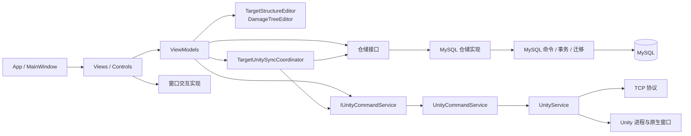

# CombatSimulation 架构说明

## 1. 系统定位

CombatSimulation 是一个 .NET 8 / WPF 桌面管理端，运行时同时协调三个边界：

- WPF：目标、系统、部件和毁伤树的编辑与状态展示；
- MySQL：目标结构和毁伤树的唯一持久化事实来源；
- Unity：独立进程中的三维展示端，通过 TCP 接收命令和只读数据库快照。

主窗口包含“目标信息”“推演设定”“作战推演”三个模块。当前目标信息模块具备完整的 MySQL 与 Unity 集成；推演设定和作战推演仍是前端演示级实现，尚未接入持久化和真实仿真引擎。

## 2. 总体依赖关系

主要依赖方向是“表现层 → 应用协调/领域规则 → 接口 → 基础设施实现”。ViewModel 不直接创建 MySQL 仓储、Unity 命令实现或 WPF 窗口。

## 3. 启动和对象所有权

### 3.1 应用级生命周期

`App` 是应用级组合根：

1. 使用命名 Mutex 限制单实例运行；
2. 创建并显示 `MainWindow`；
3. 把主窗口句柄交给 `UnityService.Instance`；
4. 后台启动 Unity 进程和 TCP 连接；
5. 应用退出时限时释放 Unity 服务和所启动的 Unity 进程。

`UnityService` 是应用级单例，持有 TCP、进程管理、请求响应匹配和原生窗口宿主状态。

### 3.2 目标模块组合根

`TargetInfoView` 是目标模块的组合根，负责创建：

- `MySqlTargetInfoRepository`；
- `MySqlDamageTreeRepository`；
- `UnityCommandService`；
- `TargetInteractionService`；
- `TargetInfoViewModel`。

页面关闭时先释放 ViewModel，使协调器解除事件订阅并取消后台任务；随后释放 `UnityCommandService`，解除其对应用级 `UnityService` 的订阅。

### 3.3 弹窗生命周期

弹窗 ViewModel 通过两个小协议与 Window 通信：

- `IDialogRequestClose`：请求以确认或取消结果关闭；
- `IDialogRequestMessage`：请求显示校验消息。

`DialogWindowBase` 负责真正设置 `DialogResult` 和调用 `MessageBox`。弹窗 ViewModel 不依赖 `MessageBox` 或具体 Window。

## 4. 表现层

### 4.1 Views 与资源

`Views/` 只承担 DataContext 组装、WPF 事件桥接和窗口生命周期。公共视觉定义位于 `Resources/Styles/`，避免主窗口和模块 XAML 内嵌大段样式。

目标模块的三个主要代码后置均保持轻量：

- `TargetInfoView.xaml.cs`：依赖组装、初始化和释放；
- `TargetStructureInfoView.xaml.cs`：TreeView 选择和上下文菜单；
- `TargetDamageTreeInfoView.xaml.cs`：毁伤树选择、菜单和导出对话框。

### 4.2 Controls

复杂但纯视图行为被隔离在 `Controls/`：

- `DamageTreeGraphView`：毁伤树布局、绘制、缩放和图片编码；
- `DamageTreePreviewElements`：预览图形元素；
- `UnityHostControl`：稳定的 Win32 子窗口宿主；
- `UnityHostLifecycleCoordinator`：Unity 子窗口显示、隐藏、尺寸同步、重试和取消状态机。

### 4.3 ViewModels

ViewModel 负责可绑定状态、命令、页面选择和应用流程编排。`TargetInfoViewModel` 使用 partial 文件按职责拆分：

- `Data`：加载、筛选和仓储操作串行化；
- `TargetOperations`：目标 CRUD 流程；
- `StructureOperations`：系统和部件 CRUD 流程；
- `DamageTree`：毁伤树和节点 CRUD、选择状态；
- `Tree`：WPF 结构树节点导航；
- `Details`：详情面板投影；
- `Commands`：把交互服务结果路由到应用操作；
- `Unity`：将当前界面状态投影给 Unity 协调器。

ViewModel 只依赖仓储和 Unity 命令接口；具体实现由 `TargetInfoView` 注入。

## 5. 领域编辑服务

### 5.1 TargetStructureEditor

集中处理不需要数据库或 WPF 控件的目标结构规则：

- 目标、系统、部件草稿创建；
- 目标字段规范化；
- 目标、系统、部件编码唯一性校验；
- 系统改号后内存中子系统和部件引用同步；
- 部件编辑结果和参数集合回写。

### 5.2 DamageTreeEditor

集中处理毁伤树领域规则：

- 毁伤树、中间节点、叶子节点草稿创建；
- 轻度、中度、重度等级归一化和去重；
- 根节点补齐；
- 树和节点编码唯一性校验；
- 叶子节点必须绑定当前目标中存在的部件；
- 历史加载数据过滤；
- 编辑结果回写和默认节点选择。

这两个服务可在不启动 WPF、MySQL 或 Unity 的情况下测试。

## 6. 持久化层

### 6.1 仓储端口

- `ITargetInfoRepository`：目标、系统、部件 CRUD，以及 Unity 数据库快照读取；
- `IDamageTreeRepository`：毁伤树和毁伤节点 CRUD。

接口全部为异步形式并支持 `CancellationToken`。ViewModel 使用 `SemaphoreSlim` 串行化同一模块的仓储访问，避免一个仓储实例被并发使用。

### 6.2 MySQL 实现

`MySqlTargetInfoRepository` 和 `MySqlDamageTreeRepository` 完成 WPF 模型与数据库行实体的映射，并在多表操作时声明事务边界。

底层 `MySqlCommand_TJ` 目前仍是同步 API。`BackgroundRepositoryOperation` 在基础设施层统一将同步调用调度到后台线程。因此取消令牌可以阻止尚未开始的操作，但不能强制中断已经发送给 MySQL 的同步命令。

### 6.3 迁移

`DatabaseSchemaMigrator` 使用 `t_schema_version` 记录版本：

- v1：创建五张业务表；
- v2：补齐毁伤节点排序字段；
- v3：补齐常用关联索引；
- v4：统一旧版非 GUID 标识和跨表引用。

`LegacyIdentifierMigrator` 在同一事务内迁移目标、系统、部件、毁伤树和节点，并同步修复跨表引用。读取方法不再重复执行历史数据修复。

## 7. Unity 集成

### 7.1 协议模型

`Models/Unity/CombatDatabaseSnapshot.cs` 定义独立的 Unity DTO。协议层不引用 MySQL 行实体或数据库映射特性，避免数据库结构直接成为跨进程协议。

### 7.2 命令端口

`IUnityCommandService` 暴露显示目标、高亮部件、显示部件集合、加载数据库快照和通用 request/event 命令。`UnityCommandService` 只负责把这些调用映射为 Unity TCP 消息。

### 7.3 同步协调

`TargetUnitySyncCoordinator` 负责：

- 目标切换与部件高亮取消；
- 勾选部件同步防抖；
- 数据库变更后的快照防抖；
- Unity `server_ready` 或快照请求事件处理；
- 重连后的目标、勾选部件和高亮状态恢复；
- 后台异常转换为界面状态。

Unity 是只读运行时缓存，不写 MySQL。数据库提交成功后再通知 Unity；Unity 暂时离线不会回滚已经提交的数据库事务。

## 8. 关键数据流

### 8.1 初始加载

1. `TargetInfoView.Loaded` 调用 `TargetInfoViewModel.InitializeAsync`；
2. ViewModel 通过 `ITargetInfoRepository.LoadTargetsAsync` 读取目标结构；
3. 仓储把五表中的目标相关数据映射为模型树；
4. ViewModel 创建 WPF 结构树投影并更新绑定集合；
5. 目标选择变化时协调器通知 Unity 显示目标。

### 8.2 写操作

1. Window 返回编辑草稿；
2. 领域编辑服务规范化并校验；
3. ViewModel 调用仓储；
4. 仓储在事务内更新 MySQL；
5. 数据库成功后 ViewModel 才更新绑定模型；
6. 协调器防抖后读取完整快照并发送给 Unity；
7. 快照完成后恢复当前目标、可见部件和高亮状态。

### 8.3 删除异常

被毁伤树引用的部件或系统删除时，仓储返回明确的业务阻止原因；其他数据库异常由 ViewModel 捕获，界面数据只有在数据库成功后才移除。

## 9. 测试与构建

`CombatSimulation.Tests` 是不依赖额外测试框架的离线测试驱动器，覆盖：

- 颜色和毁伤等级格式；
- 领域编辑规则；
- ViewModel 初始化和事件释放；
- Unity 快照 DTO 契约；
- 删除异常和用户确认；
- 弹窗消息协议。

日常验证使用 `--no-restore`，不会访问 NuGet。真实 MySQL 事务、迁移和 Unity 联调仍需独立集成环境。

## 10. 当前已知边界

1. 项目仍是单个 WPF 程序集，分层目前通过目录、命名空间和接口维持，并没有由多个项目强制引用方向。
2. 领域模型继承 `ObservableObject`，因此模型仍带有 MVVM 通知能力，并非完全独立的纯领域对象。
3. MySQL 驱动路径仍以同步命令为主；真正的执行中取消需要继续改造底层数据访问。
4. `TargetInfoViewModel` 虽已按职责和领域服务拆分，但仍是页面级协调器；继续拆分时应优先提取应用用例，而不是只按行数拆文件。
5. `UnityService` 是应用级单例，便于统一管理进程、TCP 和请求匹配，但会提高多实例集成测试难度。
6. 推演设定和作战推演目前是内存演示逻辑，尚未形成与目标数据库、Unity 仿真命令相连的真实推演用例。
7. v4 数据迁移尚需在生产数据副本上执行集成验证；首次升级前必须备份数据库。

## 11. 扩展约定

- 新业务规则优先放入领域编辑服务，不放入 View 代码后置；
- 新数据访问通过仓储接口扩展，不从 ViewModel 直接调用 `MySqlCommand_TJ`；
- 新 Unity 命令通过 `IUnityCommandService` 扩展，不在页面中直接拼 TCP JSON；
- 新数据库结构变化必须新增迁移版本；
- 跨进程 DTO 与 MySQL 行实体保持分离；
- 数据库成功前不修改界面事实状态；
- 新增异常路径时同步补充离线单元测试，事务和迁移补充独立数据库集成测试。
